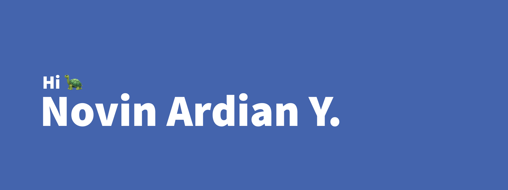

- 👋 Hi, I’m @novinbukannopin, 
- 👀 I’m interested in Computer Science, Web Developer, Data, Cyber Security, etc
- 🌱 I’m currently learning Information System - Bachelor

<!--START_SECTION:waka-->
<!--END_SECTION:waka-->

<!---
novinbukannopin/novinbukannopin is a ✨ special ✨ repository because its `README.md` (this file) appears on your GitHub profile.
You can click the Preview link to take a look at your changes.
--->
